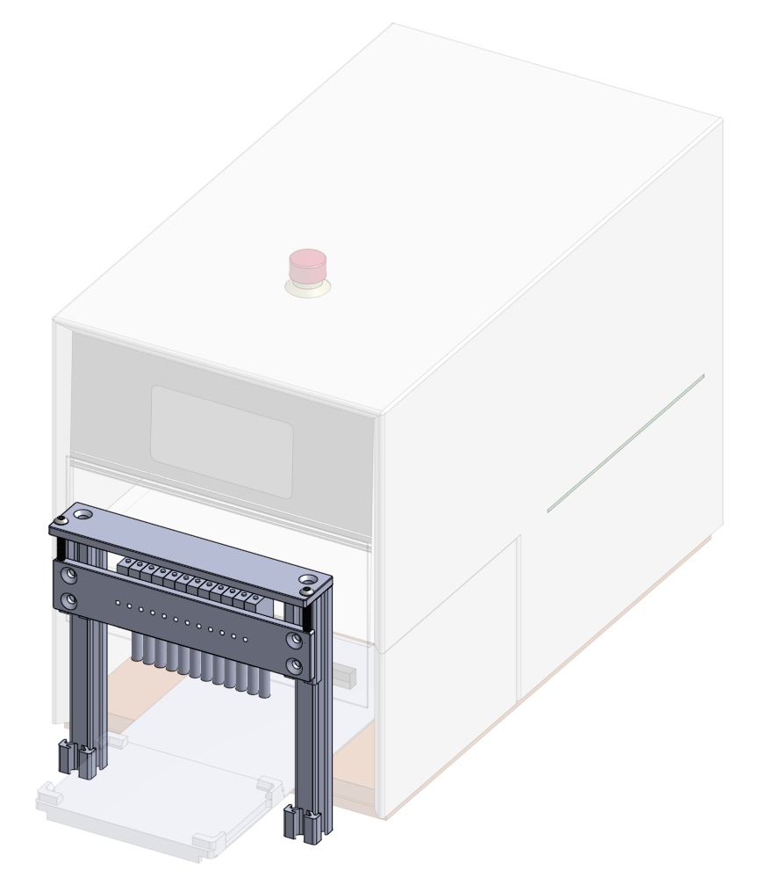

# Liquid Monitor Station Datasheet
Add quality control to your assays without needing to add an additional device in your workcell or on your benchtop. These stations fit right on top of your existing instruments. Don't wait till the end of all your experiments to find out about evaporative edge effects or clogged nozzles. Discover those failure modes right when and where they happen. Reagent dispensing has been known to vary by as much as 10% over a 1-day time period. Use our analysis tools to see trends in your own lab over time or across plates for yourself. Get peace of mind that you are drawing real biological conclusions from your data rather than interpreting liquid handling aberrations. 

   
 

## Features
* Measure liquid level of individual wells or tubes.
* Detect presence or absence of caps, seals, or lids. 
* Flag droplets, bubbles, and as of yet unknown anomalies using a spectral camera. (In development.)
* Cross reference with local recordings of temperature and humidity. (In development.)

Measuring inline ensures *all* dispenses are automatically scanned. Labware is scanned on the instrument as its tray extends. Cross reference with commanded volumes and get notified when the dispensing cassette needs to be replaced rather than relying on an arbitrary monthly calendar event. 

## Device Compatibility
* FluidX IntelliXcap
* Multidrop Combi SMART (coming soon)
* PF400 (coming soon)

## Interfaces
* For manual operation use our browser based user interface optimized for collaboration. Try for yourself here (link for live app available soon).  
* For automation use our gRPC interface. The API is open and publicly available [here](https://monomerbio.com/api).  

## Specifications

### Dimensional drawings
   
Dimensions side station (left) [DxWxH]: 165.0 x 175.0 x 217.4 mm  
Dimensions bridge station (right) [DxWxH]: 38.1 x 199.5 x 196.4 mm  

### Positioning above containers
Use the adjustment screws on the top of the station to set the reference mounting distance of the sensors above microtiter plate wells or tubes.  

### Electrical
Power: 15-30 V DC, <=35 mA per sensor  
Portrait mode (8 sensors): 280 mA  
Landscape mode (12 sensors): 420 mA  

### Volume Accuracy Table
| Labware type | Precision [%] | Accuracy [%] | Precision [uL] | Accuracy [uL] | Notes
| --- | --- | --- | --- | --- | --- |
| Micronic 1.40 ml tubes | 2 | 2 | 20 | 20 | Determined by independent party (Ginkgo Bioworks) |
| 96-well plate | | | | | In development |
| 384-well plate | | | | | In development |

